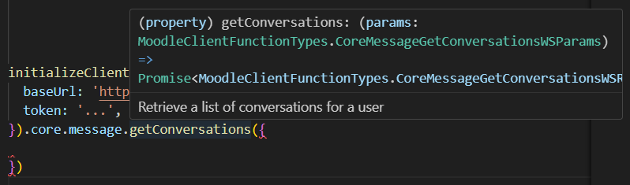
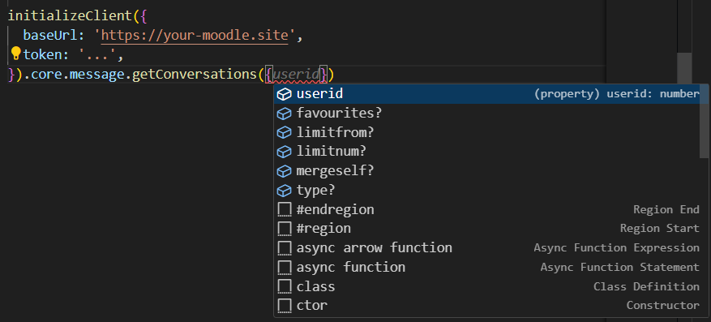
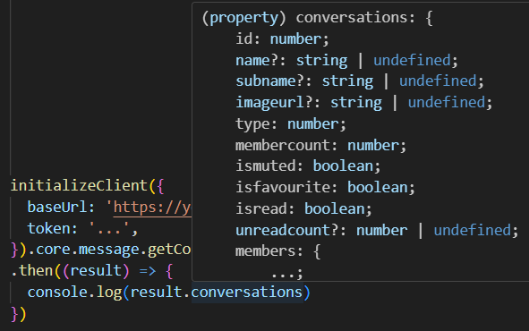

# Moodle Typed WebService

A fully typed Moodle WebService client library.

<a href="https://www.npmjs.com/package/moodle-typed-ws" rel="nofollow"></a>
<a href="https://www.npmjs.com/package/moodle-typed-ws" rel="nofollow"></a>

## Introduction

`moodle-typed-ws` is a TypeScript library aiming to provide a fully typed Moodle WebService client library. There are other alternatives on npm but they are either not typed at all or only partially typed manually by the author, which gives bad DX.

## Installation

From npm (Node/Bun)

```bash
npm install moodle-typed-ws       # npm
yarn add moodle-typed-ws          # yarn
bun add moodle-typed-ws           # bun
pnpm add moodle-typed-ws          # pnpm
```

## Usage

Get site information (using `Promise` callbacks)

```typescript
import { initializeClient } from "moodle-typed-ws";

const moodle = initializeClient({
  baseUrl: "https://moodle.example.com", // <-- Put your Moodle URL here
  token: "exppsBdQwLvNwYRoAuaiBO5j0aWTzxU6", // <-- Put your token here
});

moodle.core.webservice // <-- with intellisense and type checking
  .getSiteInfo({})
  .then((res) => console.log(res)) // <-- Response is typed
  .catch((err) => console.error(err.message));
```

Outputs

```json
{
  "sitename": "Site Name",
  "username": "...",
  "firstname": "...",
  "lastname": "...",
  "fullname": "...",
  "lang": "vi",
  "userid": "...",
  "siteurl": "https://site.url",
  "userpictureurl": "https://site.url/theme/image.php/boost/core/1685588876/u/f1",
  "functions": ["..."],
  "downloadfiles": 1,
  "uploadfiles": 1,
  "..."
}
```

## Intellisense & Typechecking

Every single function call is typed, so you will get intellisense and typechecking for free. The types is supposed to be up-to-date with the latest Moodle version, since it is generated using Moodle's own code.

### Function description



### Function parameters



### Function return



## Where do I get the token?

Here is a link to Moodle documentation to help you out: https://docs.moodle.org/402/en/Security_keys

Basically, every moodle websites are different (since the Universities seems to prefer to customize their own moodle website). So the method to get the token will also differ, but most won't customize that much, so the documentation above should be enough.

## List of functions

Refer to this file for the list of functions [src/data/ws-functions.txt](https://github.com/KhanhhNe/moodle-typed-ws/blob/main/src/data/ws-functions.txt)

## Note regarding types

The types here is automatically generated so it should be up-to-date with the latest Moodle version. If you find any type that is not correct or other issues, please open a GitHub issue. I will try to fix it as soon as possible.

# Technical details

Moodleapp source code contains a PHP script that helps generating Typescript types for all WebService function params and returns, but hidden away in the [Moodleapp repository](https://github.com/moodlehq/moodleapp). It requires a working installation of Moodle, and that's where [Moodle Docker image](https://hub.docker.com/r/bitnami/moodle/) from Bitnami comes in handy.

Using a slightly customized version of the script (you can take a look at [src/moodle-docker/get-docs.php](https://github.com/KhanhhNe/moodle-typed-ws/blob/main/src/moodle-docker/get-docs.php)), I can get the types of all Moodle WebService functions. Concatenating the file with some predefined types (defined in [src/moodle-docker/moodle-types.ts](https://github.com/KhanhhNe/moodle-typed-ws/blob/main/src/moodle-docker/moodle-types.ts)), I can get a complete list of types that I need.

Then I implemented the Moodle WebService client using a Proxy object that will catch property you try to access, provide proper typing, and call the correct function when you invoke `apply()` or simply call it (like `moodle.core.webservices.getSiteInfo({})`)
